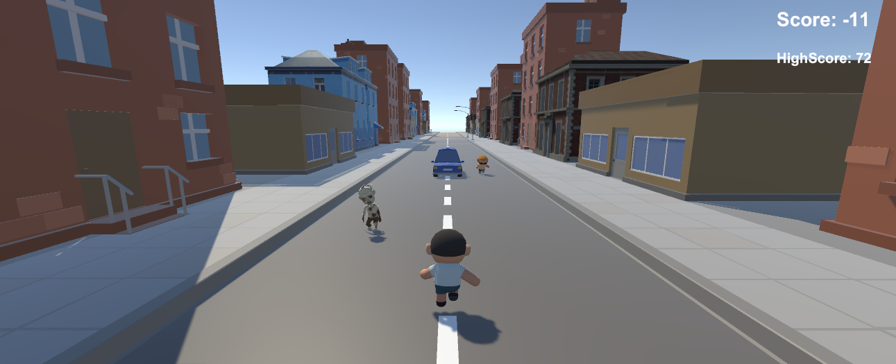

# 🪓 Zombieland 

## 📷 Screenshot

## 📖 Story
In the chaos of a zombie apocalypse, you play as a desperate father searching for his lost son.  
Armed with an endless supply of axes, you must run through the streets, dodge obstacles, kill zombies to survive, and avoid harming innocent survivors.  
Killing zombies earns you points, but killing humans will make you lose them.

## 🎮 Gameplay
- **A / D** → Move between 3 lanes (Left / Middle / Right)
- **Space** → Throw an axe forward (unlimited ammo)
- **Avoid** cars, zombies, and humans
- **Score System**:  
  - 🧟 Kill zombies → Gain points  
  - 🧍 Kill humans → Lose points  

## ⚙️ Features
- 3-lane endless runner mechanic
- Unlimited axe throwing combat system
- Running and death animations
- Sound effects for attacks and lane changes
- Game over on collision with obstacles or enemies

## ▶️ How to Play
1. Open the project in **Unity**
2. Ensure `PlayerController` is attached to the player character
3. Press **Play** and start running!
